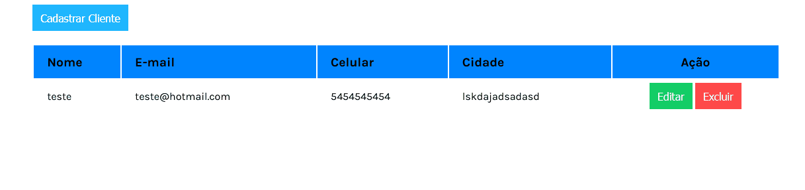

# CRUD-JavaScript-2/CRUD-Casdastro de usuario 
<h4 align="center">💻🖱Fiz esse Crud para meu Estudo de JavaScript.💻🖱</4>

### Features

- [x] Adiciona usuario
- [x] Remove usuario
- [x] Edita usuario ja cadastrado

<h1 align="center">

</h1>

### Tecnologias

As seguintes ferramentas que foram usadas na construção do projeto:

- [Html]
- [Css]
- [JavaScript]

